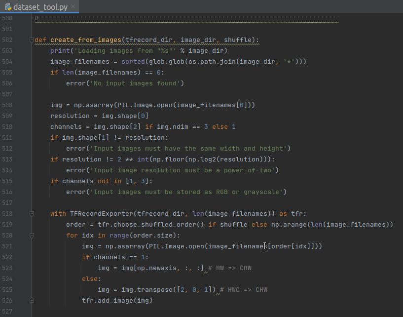
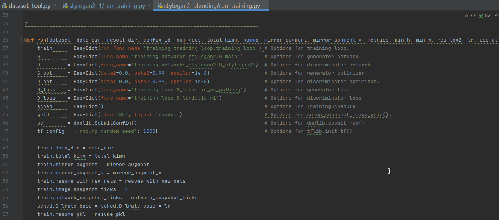
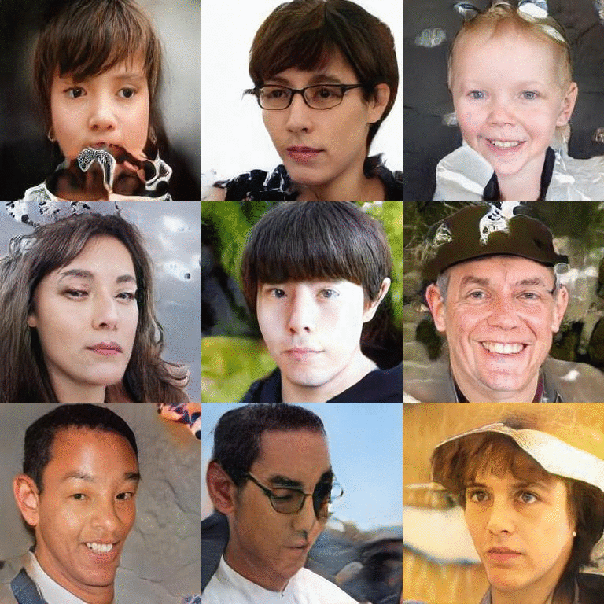

# jojofy
***
jojofy is a jojo-like faces generator inspired by Jojo's Bizarre Advanture by Hirohiko Araki and Toonify by Justin Pinkney. This project is still on-going, so what you see might not be the final result.

This is also a tutorial for those who are interested in training your own face or picture generator through transfer-training and network-blending. Hope you may find your inspiration here.

## Process:
***
### Dataset Preperation:
	1. Collect images
	2. Crop them into square pictures at desired resolution (read sections below for details)
	3. Turn images into tfrecord format

### Transfer Training:
	1. Find a pre-trained model (I used ffhq-256-config-e-003810.pkl from [Pinkney's repo](https://github.com/justinpinkney/awesome-pretrained-stylegan2))
	2. Use transfer-training to train your model based on the pre-trained model

### Network Blending:
	1. Use blend_models.py to blend your model with the pre-trained model. Check [Network blending](https://github.com/justinpinkney/toonify/blob/master/StyleGAN-blending-example.ipynb) for details.

## Datasets

Datasets used for jojofy:

### Hand-picked Jojo faces
156 hand-picked and cropped jojo faces at 256x256 rosolution. Can be found in the images folder.


## Dataset proportaion
### Collect images you want.
If there is no existing datasets, use Bulk Image Downloader extension on Google Chrome to download pictures from Google.

Then, you should crop your pictures into a square at the resolusion as required by the pre-trained model you choose. 

For example, I chose **ffhq-256-config-e-003810.pkl** as my pre-trained model, so my pictures need to be 256x256.

### Turn pictures into tfrecord format
Use **create_from_images** method from **dataset_tool.py** in stylegen2_blending folder to turn your images into tfrecord format.

```bash
python dataset_tool.py create_from_images ../data/jojo_256_tfrecord ../data/jojo_256
```



## Transfer Taining

You need to indicate **number of gpus**, **stylegan2 configeration**, **data directory**, **total training amount in n k images** (1 = 1000 images), **result directory** (includes pkl and result images), **resume pkl** (This is where you put the pre-trained model pkl to do transfer training or resume training)

```bash
python run_training.py --num-gpus=1 --config=config-e --data-dir=../data/ --dataset=jojo_256_tfrecord --total-kimg=1 --result-dir=../transfer_training_pkls/ --resume-pkl=../ffhq-256-config-e-003810.pkl
```
You may modify **run_training.py** for your own purposes.
I recommend changing **image_snapshot_ticks** to **None** if your computer is not too powerful and you are training with relatively small kimgs because creating such image snapshots could take a while.



## Network Blending

The last step is to blend the model you trained with the original pre-trained model.
This is done by using **blend_models.py**, and you need to indicate **LOW_RES_PKL** (this is the model you wish to extract low resolution features), **HIGH_RES_PKL** (for high resolution features), **RESOLUTION** (At which resolution do you wish to swap between models)

Check [Network blending](https://github.com/justinpinkney/toonify/blob/master/StyleGAN-blending-example.ipynb) for details.

```bash
python blend_models.py Low_Res.pkl High_Res.pkl 128 --output-grid=../blended_pkls/"blended_128.jpg" --output-pkl=../blended_pkls/"blended_128.pkl"
```

## Results

Transfer training result:


Network-blending result:



